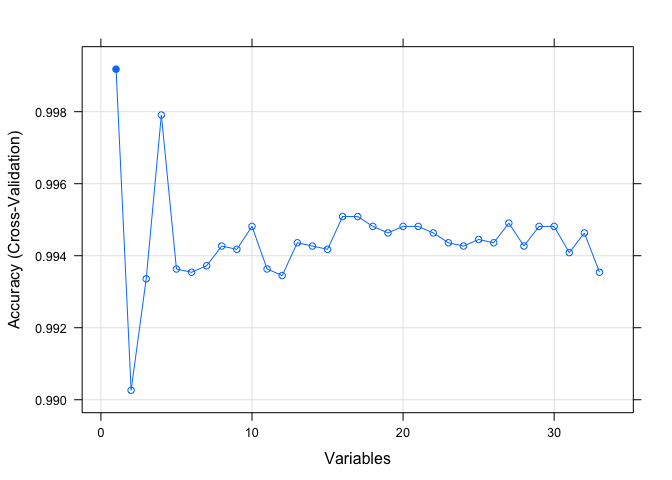
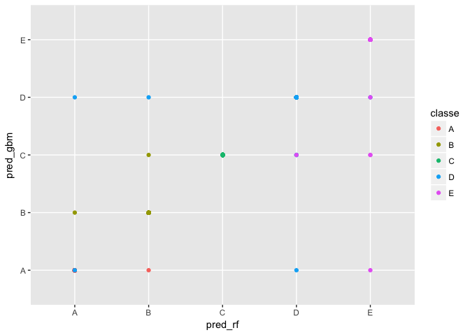

# Predicting the quality of the weight lifting exercise
Lishu Zhang  
August 8, 2017  

## Summary

The quality of an excise is as important as its quantity, which, however is neglected by many people. The goal of this project is to predict the manner in which the participants did the weight lifting exercise. A tidy dataset was obtained by cleaning and preprocessing. Feature selections including correlation matrix (CM) and recursive feature elimination (RFE) were performed on the training dataset to reduce the number of variables for machine learning. Two Algrithms, random forest (RF) and generalized boost model (GBM), were used to build prediction models and tested on the testing dataset and further on the validation dataset. The RF model was selected for the quiz prediction based on its better prediction performance than the GBM one, measured by their accuracy.

## Introduction

Using devices such as Jawbone Up, Nike FuelBand and Fitbit it is now possible to collect a large amount of data about personal activity relatively inexpensively. One thing that people regularly do is to quantify how much of a particular activity they perform in their exercise, but they rarely quantify how well they do it. 

In this project, a set of data were acquired from accelerometers on the belt, forearm, arm, and dumbell of six participants who were asked to perform barbell lifts correctly and incorrectly in five different ways: Class A - exactly according to the specification; Class B - throwing the elbows to the front; Class C - lifting the dumbbell only halfway; Class D - lowering the dumbbell only halfway; and Class E - throwing the hips to the front.

Our goal is to use this weight lifting exercises dataset to predict the manner in which the participants did the weight lifting. The following questions will be addressed:
1. how the model is build?
2. how cross validation is used?
3. what the expected out of sample error is?
4. why you made the choices you did?
5. use the prediction model to predict 20 different test cases.

## data obtaining

The two data files (training and testing) required for the project were downloaded from the link below and stored in the working directory. All irregular values were read as NAs.

https://d396qusza40orc.cloudfront.net/predmachlearn/pml-training.csv
https://d396qusza40orc.cloudfront.net/predmachlearn/pml-testing.csv


## data cleaning

To obtain a tidy data for machine learaning, we processed the data with the following:
(1) the first 6 variables were excluded from the dataset because they contain factual information thus not useful for machine learning;
(2) any variable containing > 60% of NAs was excluded from the dataset;
(3) NAs were imputed with KNN algorithm;
(4) Variables were further excluded with the Near Zero function.


We then Split the dataset into training, testing and validation set.


## Feature selection
### A. Create a correlation matrix of variables on the dataset to remove redundant features


Features with CMs less than a cutoff of 0.75 are used for further analysis. In total 33 features were selected based on the results of the CM analysis. Those are:

```
##  [1] "num_window"           "yaw_belt"             "gyros_belt_x"        
##  [4] "gyros_belt_y"         "gyros_belt_z"         "magnet_belt_x"       
##  [7] "magnet_belt_y"        "roll_arm"             "pitch_arm"           
## [10] "yaw_arm"              "total_accel_arm"      "gyros_arm_y"         
## [13] "gyros_arm_z"          "accel_arm_y"          "magnet_arm_x"        
## [16] "magnet_arm_z"         "roll_dumbbell"        "pitch_dumbbell"      
## [19] "yaw_dumbbell"         "total_accel_dumbbell" "gyros_dumbbell_y"    
## [22] "magnet_dumbbell_z"    "roll_forearm"         "pitch_forearm"       
## [25] "yaw_forearm"          "total_accel_forearm"  "gyros_forearm_x"     
## [28] "gyros_forearm_z"      "accel_forearm_x"      "accel_forearm_z"     
## [31] "magnet_forearm_x"     "magnet_forearm_y"     "magnet_forearm_z"
```

### B. Use the Recursive Feature Elimination (RFE) method to reduce variables

The RFE analysis shows that the 33 features have accruracies between 0.9992 to 0.9935. The plot below shows the results. 

<!-- -->

We choose four variables with accuracy values greater than 0.995 as our predictors for further analysis. Those are:

```
## [1] "num_window"    "gyros_belt_y"  "magnet_arm_z"  "roll_dumbbell"
```

## Out-of-sample error

For the feature selection, we use the RFE analysis to get the variables for building up machine learning algorithms. The resampling method used in the analysis is cross validation. The out-of-sample error is caculated as 1 - accuracy. Because the cutoff was set as an accuracy of 0.995 the out-of-sample error is 0.005. 

## Machine learning

To obtain a better algorithm for machine learing, we build two different models: random forest and 
boosting with trees (GBM).


Here show the results using the random forest model for machine learning. The accuracy for this model is 0.992.


```
##   mtry  Accuracy     Kappa  AccuracySD     KappaSD
## 1    2 0.9836537 0.9793241 0.003034636 0.003840159
## 2    3 0.9920917 0.9899974 0.002304180 0.002914122
## 3    4 0.9921517 0.9900736 0.003451261 0.004363486
```

Below show the results using the boosting with trees model for machine learning. The accuracy for this model is 0.996.


```
##   shrinkage interaction.depth n.minobsinnode n.trees  Accuracy     Kappa
## 1       0.1                 1             10      50 0.5893785 0.4683251
## 4       0.1                 2             10      50 0.8156264 0.7646815
## 7       0.1                 3             10      50 0.8902448 0.8605975
## 2       0.1                 1             10     100 0.6499471 0.5494366
## 5       0.1                 2             10     100 0.9314758 0.9131042
## 8       0.1                 3             10     100 0.9845449 0.9804407
## 3       0.1                 1             10     150 0.7019334 0.6174790
## 6       0.1                 2             10     150 0.9800912 0.9748036
## 9       0.1                 3             10     150 0.9962700 0.9952812
##    AccuracySD     KappaSD
## 1 0.009218690 0.012520718
## 4 0.012234336 0.015688542
## 7 0.008037053 0.010182698
## 2 0.009184248 0.011745771
## 5 0.009105480 0.011581420
## 8 0.003314207 0.004199712
## 3 0.009183083 0.011548077
## 6 0.004829365 0.006121898
## 9 0.001203539 0.001522430
```

We see both the GBM model and the random forest model work similarly effecient in terms of the accuracy on the training dataset. Next we test those two models on the testing and validation datasets to see which model performs better.

## Predict on the testing dataset 

Below show the results using random forest and GBM models for prediciton on testing dataset.

<!-- -->

The overall statisitics for prediction with the random forest model on the testing dataset is as follows:


```
##       Accuracy          Kappa  AccuracyLower  AccuracyUpper   AccuracyNull 
##      0.9985129      0.9981188      0.9969383      0.9994019      0.2844699 
## AccuracyPValue  McnemarPValue 
##      0.0000000            NaN
```

The overall statisitics for prediction with the GBM model on the testing dataset is shown below:


```
##       Accuracy          Kappa  AccuracyLower  AccuracyUpper   AccuracyNull 
##      0.9976631      0.9970438      0.9958224      0.9988328      0.2844699 
## AccuracyPValue  McnemarPValue 
##      0.0000000            NaN
```

We see both the models predict similarly effeciently on the testing dataset measured by the values of accuracy, with the random forest model performing slightly better. How about their performance in the validation dataset?

## Predict on the validation dataset

<!-- -->

The overall statisitics for prediction with the random forest model on the validation dataset is as follows:


```
##       Accuracy          Kappa  AccuracyLower  AccuracyUpper   AccuracyNull 
##      0.9992353      0.9990327      0.9977668      0.9998423      0.2844762 
## AccuracyPValue  McnemarPValue 
##      0.0000000            NaN
```

The overall statisitics for prediction with the GBM model on the validation dataset is shown below:


```
##       Accuracy          Kappa  AccuracyLower  AccuracyUpper   AccuracyNull 
##      0.9977058      0.9970980      0.9956495      0.9989504      0.2844762 
## AccuracyPValue  McnemarPValue 
##      0.0000000            NaN
```

We see both the models predict similarly effeciently on the validation dataset in terms of the values of accuracy, again with the random forest model performing slightly better.

Based on the prediction performance shown above, we choose the random forest model to predict the classes on 20 test cases.

## Predict 20 test cases
The random forest model generated above is used for the prediction of those 20 test cases. The predicted classes are shown below:


```
##  [1] B A B A A E D B A A B C B A E E A B B B
## Levels: A B C D E
```

Finally we save the prediction results into a text file for permanent use.


## Acknowledgement

The datasets used for this project come from this source:
http://groupware.les.inf.puc-rio.br/har

We are thankful for the authors' generousity in allowing us to use their data for this project.
